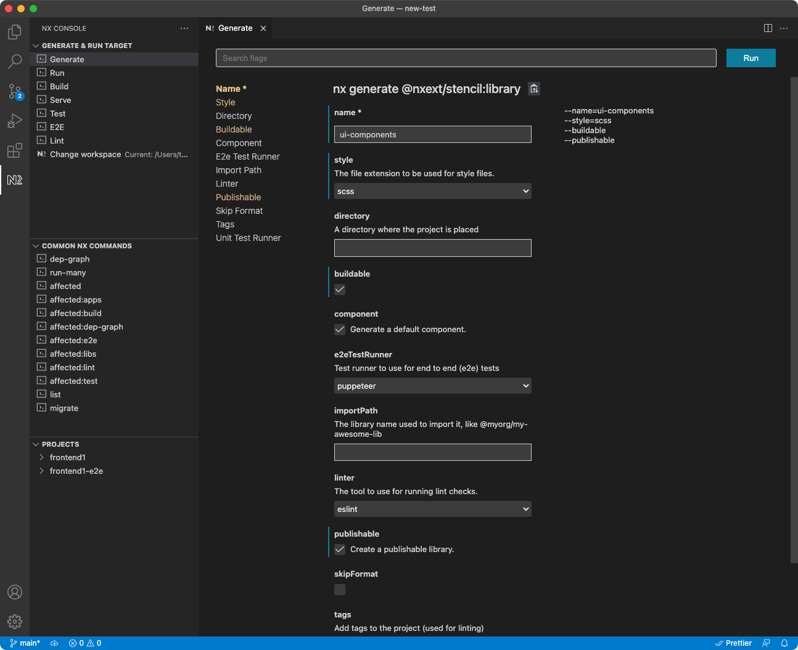
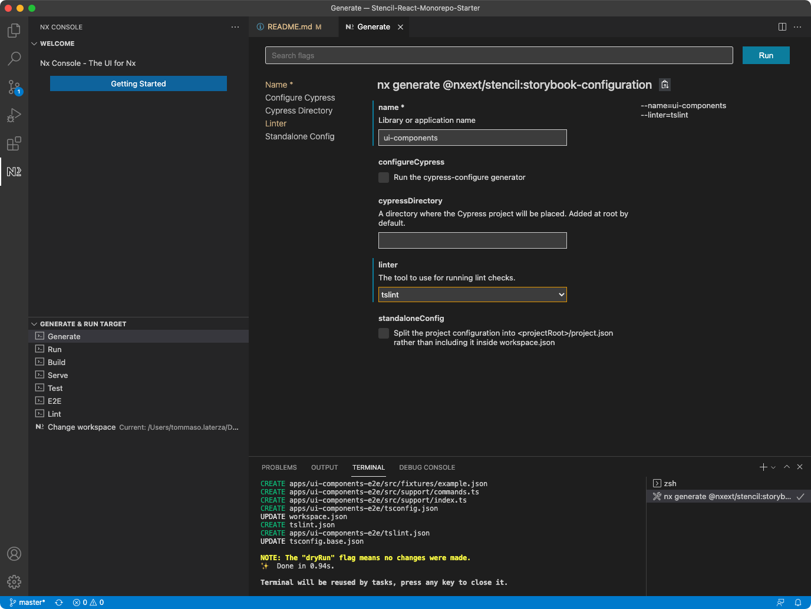
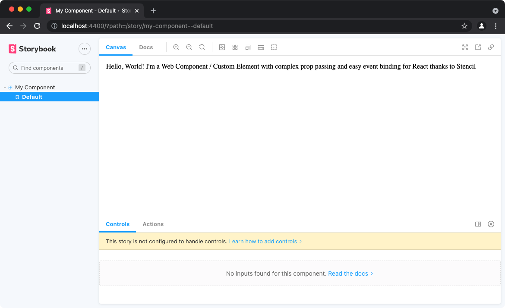

# Stencil React Monorepo Starter

Use [Stancil.js](https://stenciljs.com/) to create a framework-agnostic component library.

Then wrap it into a react library to better consume it and avoid [bumpy interactions between React and Custom Elements](https://custom-elements-everywhere.com/).

Bonus point: add [Storybook](https://storybook.js.org/)

## Instructions to replicate

### 1. Create Monorepo with NX

```
npx create-nx-workspace@latest

? Workspace name (e.g., org name)     toolkit-react
? What to create in the new workspace react
? Application name                    frontend1
? Default stylesheet format           SASS(.scss)
```

### 2. Generate new Stancil Library

Install VSC NX [Console Extension](https://marketplace.visualstudio.com/items?itemName=nrwl.angular-console)

Add Stencil.js

```bash
yarn add @nxext/stencil -D
```

Use the GUI of the Extension to generate a new Stancil Library



For some unknown reason you might have to install an angular package

```bash
yarn add @angular-devkit/schematics -D
```

### 3. Generate React bindings

Install @stencil/react-output-target as dev dependency:

`yarn add @stencil/react-output-target -D`

Update the stencil.config.ts and add the reactOutputTarget.

```javascript
export const config: Config = {
  namespace: "ui-components",
  taskQueue: "async",
  plugins: [sass()],
  outputTargets: [
    reactOutputTarget({
      componentCorePackage: "ui-components",
      proxiesFile: "../../generated/ui-components-react/src/components.ts",
    }),
    {
      type: "dist",
      esmLoaderPath: "../loader",
      dir: "../../dist/libs/ui-components/dist",
    },
    {
      type: "www",
      dir: "../../dist/libs/ui-components/www",
      serviceWorker: null, // disable service workers
    },
  ],
};
```

### 4. Add path mapping

In tsconfig.base.json add this under `paths`:

```javascript
"ui-components": ["dist/libs/ui-components"],
"ui-components/loader": ["dist/libs/ui-components/loader"],
"ui-components-react": ["dist/generated/ui-components-react/src/components.ts"]
```

### 5. Set up the react app

in `main.tsx` of your react app (frontend1 in this case) add

```javascript
import { defineCustomElements } from 'ui-components/loader';

...

defineCustomElements( window );
```

### 6. Build the library

Run `yarn nx serve ui-components` to start a server for you lib and work on your components.

Run `yarn nx build ui-components` to build it.

### 7. Consume the library in the React app

Inside the app use the custom components as follow:

```javascript
import { MyComponent } from 'ui-components-react';

...

    <MyComponent first="a Web Component / Custom Element"
                 middle={[
                   'with complex prop passing and easy event binding',
                   'for React'
                 ]}
                 last="thanks to Stencil">
  ];
```

Run `yarn nx build frontend1` to start a server for your react app.

### 8. Troubleshooting

Make sure your `babel.config.json` includes the presets

```javascript
{
  "presets": ["@nrwl/web/babel", "@babel/preset-react"],
  "babelrcRoots": ["*"]
}
```

and add dependacies

```bash
yarn add @babel/preset-react -D
```

## Adding Storybook

### 1. Generate Storybook Configuration with NX

Use the GUI of the NX Extension to generate storybook configuration files



### 2. Create a story

Inside `my-component` folder create a file named `my-component.stories.js` and add

```javascript
import { storiesOf } from "@storybook/html";
import { h } from "@stencil/core";
import readme from "./readme.md";

storiesOf("My Component", module).add(
  "Default",
  () => (
    <my-component
      first="a Web Component / Custom Element"
      middle={["with complex prop passing and easy event binding", "for React"]}
      last="thanks to Stencil"
    />
  ),
  {
    notes: {
      markdown: readme,
    },
  }
);
```

Make sure to import `h`

### 3. Run Storybook

To start Storybook run

```bash
yarn nx serve ui-components:storybook
```

This should be the result


